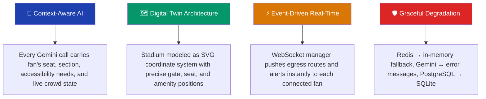
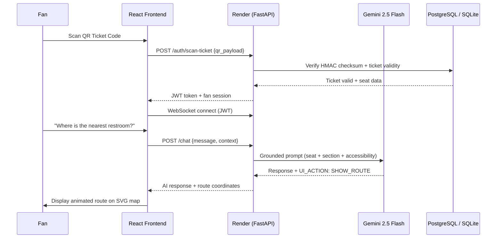
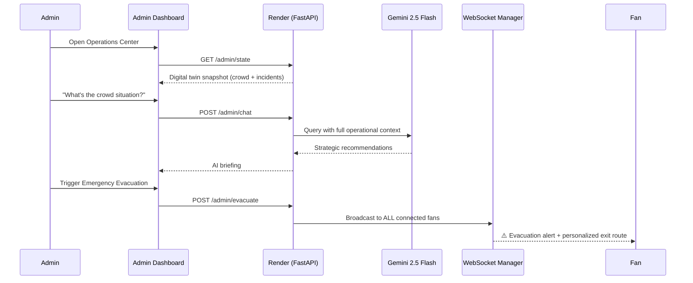
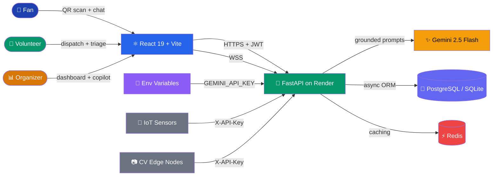

<div align="center">


<br/>

[](https://github.com/shaktisingh5580/Stadium_Sync/actions/workflows/ci.yml)
[](https://github.com/shaktisingh5580/Stadium_Sync/actions/workflows/codeql.yml)
[](LICENSE)
[](backend/)
[](frontend/)
[](#testing)

[](https://github.com/shaktisingh5580/Stadium_Sync/stargazers)
[](https://github.com/shaktisingh5580/Stadium_Sync/network/members)
[](https://github.com/shaktisingh5580/Stadium_Sync/commits)

**📦 Repository:** [github.com/shaktisingh5580/Stadium_Sync](https://github.com/shaktisingh5580/Stadium_Sync)

[](https://stadium-sync.onrender.com)
[](https://stadium-sync.vercel.app)

</div>

---

## 🏟️ Chosen Vertical

> **Smart Stadiums & Tournament Operations** (FIFA World Cup 2026) — one platform, three personas.

<table>
<tr>
<td width="33%" valign="top">

### 🎉 Fans
AI concierge for navigation, accessibility routing, waste classification, multilingual help, and personalized egress.

</td>
<td width="33%" valign="top">

### 👷 Volunteers
AI-powered incident triage, proximity-based dispatch, and real-time coordination via WebSocket.

</td>
<td width="33%" valign="top">

### 📊 Organizers
Digital twin heatmap, AI copilot, emergency evacuation, CV webhooks, and flash sale targeting.

</td>
</tr>
</table>

---

## 🧠 Approach & Logic



1. **Context-Aware AI** — Every Gemini call carries the authoritative venue dataset (gates, sections, facilities, transport, accessibility routes) and the fan's exact seat, section, and accessibility needs. No hallucinated gate numbers.
2. **Digital Twin Architecture** — The stadium is modeled as an SVG-based coordinate system where every section, gate, amenity, and seat has precise `(x, y)` coordinates, enabling the AI to generate actual navigable routes.
3. **Event-Driven Real-Time** — A WebSocket manager maintains persistent connections to every connected fan. Evacuation alerts and egress routes are pushed instantly, not polled.
4. **Graceful Degradation** — Every external dependency (Redis, Gemini API, PostgreSQL) has a fallback path. Redis falls back to in-memory, Gemini failures return structured error messages, and SQLite serves as the local development database.

### Decision-Making Logic

- **Egress Route Optimization**: Computes personalized routes by finding the nearest gate to the fan's assigned seat, calculating the shortest path through the stadium's corridor graph, and factoring in accessibility requirements (elevator/ramp routing for wheelchair users).
- **Incident Triage**: Gemini analyzes the incident description and returns structured JSON with severity (CRITICAL → LOW), category (medical/security/facilities/crowd), and suggested response actions. Critical incidents immediately trigger admin WebSocket alerts.
- **Crowd Prediction**: IoT sensor data ingested via authenticated API endpoints feeds a linear regression model projecting crowd density 15 minutes into the future.

---

## ⚡ How It Works

### Fan Journey



### Organizer Journey



---

## ✨ 6 Distinct Gemini AI Use Cases

Stadium Sync integrates **Google Gemini 2.5 Flash** across six distinct, production-quality use cases:

| # | Use Case | Gemini Feature | Input | Output | Endpoint |
|:-:|----------|---------------|-------|--------|----------|
| 1 | **Fan AI Concierge** | Text Generation | Natural language query + fan context (seat, section, accessibility) | Navigation directions, POI info, multilingual responses with UI action commands | `POST /api/v1/chat` |
| 2 | **Incident Triage** | Structured Output | Incident description text | `{severity, category, suggested_actions, priority_score}` as validated JSON | `POST /api/v1/incidents/` |
| 3 | **Eco-Vision Waste Classification** | Vision (multimodal) | Base64-encoded camera image | `{waste_type, bin_color, confidence, eco_fact}` with nearest bin routing | `POST /api/v1/eco-vision/classify` |
| 4 | **Admin AI Copilot** | Text Generation + Context Injection | Admin query + full operational state (crowd levels, active incidents, volunteer positions) | Strategic recommendations, trend analysis, actionable decisions | `POST /api/v1/admin/chat` |
| 5 | **Multilingual Detection** | Text Generation | Any language input | Auto-detected language with native-language response (Hindi, Spanish, French, Arabic, etc.) | `POST /api/v1/chat` |
| 6 | **CV Webhook Analysis** | Vision (multimodal) | Edge-node camera frames via webhook | Crowd anomaly detection, safety alerts, automated incident creation | `POST /api/v1/admin/cv-webhook` |

---

## 🏗️ Architecture

<div align="center">



</div>

<details>
<summary><b>📁 Click to expand full folder structure</b></summary>

```text
stadium-sync/
├── backend/                        Python 3.12 · FastAPI · Uvicorn
│   ├── app/
│   │   ├── api/
│   │   │   ├── v1/                 Versioned API routes
│   │   │   │   ├── auth.py         QR scan + JWT issuance
│   │   │   │   ├── chat.py         Fan AI concierge (Gemini)
│   │   │   │   ├── crowd.py        IoT ingestion + density heatmap
│   │   │   │   ├── eco_vision.py   Waste classification (Gemini Vision)
│   │   │   │   ├── egress.py       Egress route computation agent
│   │   │   │   ├── incidents.py    Incident reporting + AI triage
│   │   │   │   ├── navigation.py   Transit preference + routing
│   │   │   │   ├── volunteers.py   Volunteer dispatch + location
│   │   │   │   ├── admin.py        Admin copilot, evacuation, flash sales
│   │   │   │   └── websocket.py    WebSocket manager + connection handling
│   │   │   └── deps.py            Dependency injection (JWT auth, DB, Redis)
│   │   ├── core/
│   │   │   ├── config.py           Pydantic settings + production validation
│   │   │   ├── security.py         JWT creation/verification (HS256)
│   │   │   ├── database.py         Async SQLAlchemy engine + sessions
│   │   │   ├── redis_client.py     Redis with graceful in-memory fallback
│   │   │   ├── rate_limiter.py     SlowAPI per-endpoint rate limiting
│   │   │   └── exceptions.py       Custom HTTP exceptions + handlers
│   │   ├── middleware/
│   │   │   ├── security_headers.py CSP, X-Frame-Options, HSTS
│   │   │   ├── logging_mw.py      Structured request/response logging
│   │   │   └── request_id.py      X-Request-ID UUID injection
│   │   ├── models/                 SQLAlchemy ORM models (15 tables)
│   │   ├── schemas/                Pydantic request/response schemas
│   │   ├── services/              Business logic layer
│   │   │   ├── gemini_client.py   Gemini API (round-robin key rotation)
│   │   │   ├── chat_service.py    Chat + context injection
│   │   │   ├── crowd_service.py   Crowd analytics + linear regression
│   │   │   ├── egress_service.py  Egress route computation engine
│   │   │   ├── incident_service.py Incident lifecycle + AI triage
│   │   │   └── navigation_service.py Indoor nav + POI routing
│   │   └── main.py                FastAPI app factory + lifespan
│   ├── tests/                     Pytest async suite (6 phases, 61 tests)
│   ├── scripts/                   Database seeder + crowd simulator
│   ├── Dockerfile                 Multi-stage build for Render
│   └── requirements.txt           Pinned Python dependencies
├── frontend/
│   ├── src/
│   │   ├── api/                   Axios client + typed API functions
│   │   ├── components/
│   │   │   ├── StadiumChat.tsx    Primary fan interface (chat + map)
│   │   │   ├── map/               Interactive SVG map + heatmap + routes
│   │   │   ├── ui/               Chat bubbles, egress alerts, eco-vision
│   │   │   └── auth/             QR scanner + dev bypass
│   │   ├── hooks/
│   │   │   ├── useChat.ts        Chat state + Gemini API calls
│   │   │   └── useRealtime.ts    WebSocket connection + events
│   │   ├── pages/                AdminDashboard (command center)
│   │   └── types/                Shared TypeScript interfaces
│   ├── index.html                Entry point with SEO meta tags
│   └── package.json              React 19, Vite, TailwindCSS
├── .github/
│   ├── workflows/
│   │   ├── ci.yml                Tests + lint + security audits
│   │   └── codeql.yml            CodeQL static analysis
│   └── CODEOWNERS                Code ownership
├── SECURITY.md                   Threat model + disclosure policy
├── CHANGELOG.md                  Version history (Keep a Changelog)
├── CONTRIBUTING.md               Contribution guidelines
├── LICENSE                       MIT License
├── .editorconfig                 Consistent formatting
├── render.yaml                   Render IaC blueprint (one-click deploy)
└── README.md                     This file
```

</details>

---

## 🛠️ Tech Stack

<div align="center">


</div>

| Layer | Technology | Purpose |
|-------|-----------|---------|
| **Frontend** | React 19, TypeScript (strict), Vite, TailwindCSS | Responsive mobile-first SPA with strict type safety |
| **Animations** | Framer Motion | Smooth page transitions, chat bubble animations |
| **Backend** | FastAPI, Python 3.12, Uvicorn | Async REST API + WebSocket server |
| **AI Engine** | Google Gemini 2.5 Flash (6 use cases) | Chat, triage, eco-vision, admin copilot, multilingual, CV analysis |
| **Database** | PostgreSQL (Neon Serverless) / SQLite | 15-table async ORM with connection pooling |
| **Cache** | Redis | Rate limiting, session state, crowd density cache |
| **Auth** | JWT (HS256) + HMAC-SHA256 QR codes | Stateless auth with cryptographic ticket verification |
| **Real-Time** | WebSocket (native FastAPI) | Egress routes, emergency alerts, crowd updates |
| **Deployment** | Render (Docker) + Vercel (Static) | Serverless containers with automatic CI/CD |
| **Testing** | Pytest (async), Vitest, React Testing Library | Backend (61 tests) + frontend (20 tests) |
| **Security** | SlowAPI, HMAC, CORS, CSP, HSTS, CodeQL | Production-grade hardening + static analysis |

---

## ☁️ Cloud & AI Integration

| Service | Role | Where |
|---------|------|-------|
|  | Hosts containerized FastAPI backend (Docker) with auto-deploy from GitHub | `backend/Dockerfile` + `render.yaml` |
|  | Hosts React/Vite frontend as static site with global CDN | `frontend/dist` |
|  | 6 distinct AI use cases: chat, triage, eco-vision, copilot, multilingual, CV analysis | `backend/app/services/gemini_client.py` |
|  | Multi-stage build with non-root user, demo data baked in | `backend/Dockerfile` |

---

## 🔒 Security

See [SECURITY.md](SECURITY.md) for the full threat model.

| Layer | Protection |
|-------|-----------|
| 🔑 **Secrets** | Render environment variables for API keys — nothing sensitive in repo/image/history |
| 🔐 **Authentication** | HS256 JWT (4-hour expiry) + HMAC-SHA256 QR ticket integrity |
| 🧾 **Input Validation** | Pydantic v2 schemas with `min_length`, `max_length`, regex patterns on all inputs |
| 🛡️ **HTTP Hardening** | CSP, X-Frame-Options, HSTS, X-Content-Type-Options, explicit CORS allowlist |
| ⏱️ **Rate Limiting** | SlowAPI with per-endpoint limits (auth: 10/min, AI: 20/min, IoT: 300/min) |
| 🚨 **Error Hygiene** | Central exception handler, sanitized responses, stack traces server-side only |
| 📦 **Supply Chain** | `pip-audit` + `npm audit --audit-level=high` in CI; CodeQL on every push |
| 🔍 **Static Analysis** | CodeQL (`security-extended`) for Python + TypeScript on every push + weekly |
| 🐳 **Container** | Non-root `appuser`, multi-stage build, minimal `python:3.12-slim` base |
| 📬 **Disclosure** | [`/.well-known/security.txt`](/.well-known/security.txt) (RFC 9116) |

---

## ♿ Accessibility (WCAG 2.2)

| Feature | Implementation |
|---------|---------------|
| ✅ **Semantic HTML** | All interactive regions use `role`, `aria-label`, `aria-live` attributes |
| ✅ **Keyboard Navigation** | Full keyboard accessibility for chat, map, and sidebar panels |
| ✅ **Screen Reader Support** | Chat messages via `aria-live="polite"`, alerts via `aria-live="assertive"` |
| ✅ **Accessible Routing** | `needs_accessibility` flag enables elevator/ramp-only navigation routes |
| ✅ **Dedicated Sections** | Section S200 designated accessible with lower capacity and wider spacing |
| ✅ **Reduced Motion** | `@media (prefers-reduced-motion: reduce)` disables animations globally |
| ✅ **Color Contrast** | Emerald-on-slate scheme meets WCAG AA contrast requirements |
| ✅ **Focus Indicators** | Visible focus rings on all interactive elements |
| ✅ **ESLint a11y** | `jsx-a11y` lint rules enforced in CI |

---

## 🚀 Getting Started

### Prerequisites

- Python 3.12+
- Node.js 20+
- Redis (optional — gracefully falls back to in-memory)
- A Google Gemini API key ([get one here](https://makersuite.google.com/app/apikey))

### Backend Setup

```bash
cd backend

# Create virtual environment
python -m venv .venv
source .venv/bin/activate  # or .venv\Scripts\activate on Windows

# Install dependencies
pip install -r requirements.txt

# Copy and configure environment
cp .env.example .env
# Edit .env: set GEMINI_API_KEY_1, SECRET_KEY, TICKET_QR_SIGNING_KEY

# Seed the database with test data (20 fans, 8 sections, 4 gates)
python scripts/generate_test_tickets.py

# Start the server
uvicorn app.main:app --reload --port 8000
```

### Frontend Setup

```bash
cd frontend

# Install dependencies
npm install

# Start development server
npm run dev
```

### Access the Application

- **Fan Interface**: `http://localhost:5173` → Click "Dev Bypass" to auto-login
- **Admin Dashboard**: `http://localhost:5173?admin=true` → Organizer command center
- **API Docs (Swagger)**: `http://localhost:8000/docs`
- **API Docs (ReDoc)**: `http://localhost:8000/redoc`

---

## 📋 API Documentation

| Method | Endpoint | Auth | Description |
|--------|----------|------|-------------|
| `POST` | `/api/v1/auth/scan-ticket` | — | QR code ticket auth (HMAC verified) |
| `GET` | `/api/v1/auth/me` | Fan | Current fan session with seat data |
| `POST` | `/api/v1/chat` | Fan | AI concierge chat (Gemini text gen) |
| `POST` | `/api/v1/navigation/transit` | Fan | Set transit preference |
| `GET` | `/api/v1/navigation/route` | Fan | Personalized egress route |
| `POST` | `/api/v1/eco-vision/classify` | Fan | AI waste classification (Gemini Vision) |
| `POST` | `/api/v1/incidents/` | Fan | Report incident → AI triage (Gemini) |
| `POST` | `/api/v1/crowd/ingest` | IoT | Ingest turnstile crowd data |
| `GET` | `/api/v1/crowd/map/{id}` | Fan | Crowd density heatmap |
| `POST` | `/api/v1/egress/trigger` | Staff | Trigger egress route agent |
| `GET` | `/api/v1/admin/state` | Admin | Full digital twin state |
| `POST` | `/api/v1/admin/chat` | Admin | Admin AI Copilot (Gemini) |
| `POST` | `/api/v1/admin/evacuate` | Admin | Emergency evacuation broadcast |
| `POST` | `/api/v1/admin/cv-webhook` | IoT | CV edge-node analysis (Gemini Vision) |
| `WS` | `/api/v1/ws?token=` | JWT | Real-time bidirectional WebSocket |

---

## 🧪 Testing

<div align="center">


</div>

<details>
<summary><b>🖥️ Backend — 61 tests across 6 phases</b></summary>

Full async test suite using `pytest-asyncio` with in-memory SQLite:

1. **Foundation** — Database models, health endpoint, configuration validation
2. **Authentication** — QR scan flow, JWT verification, HMAC integrity checks
3. **Navigation** — Transit preferences, route computation, accessibility routing
4. **Features** — Chat AI, eco-vision classification, incident triage, crowd management
5. **Real-Time** — WebSocket connections, egress broadcasts, emergency alerts
6. **End-to-End** — Full fan journey from QR scan to egress

```bash
cd backend
pytest tests/ -v --cov=app --cov-report=term-missing
```

</details>

<details>
<summary><b>💻 Frontend — 20 tests with React Testing Library</b></summary>

Component and hook tests:
- App routing and authentication flow
- API client error handling and token management
- `useChat` hook state management
- Accessibility component compliance
- UI component rendering (GlowButton, GlowCard, TabButton)

```bash
cd frontend
npm run test
```

</details>

<details>
<summary><b>🔍 Static Analysis & Lint</b></summary>

- **TypeScript**: `strict: true` with `noUnusedLocals`, `noUnusedParameters`, `noFallthroughCasesInSwitch`
- **ESLint**: React + `jsx-a11y` accessibility rules
- **CodeQL**: `security-extended` analysis on every push
- **pip-audit**: Python dependency vulnerability scanning in CI
- **npm audit**: Node.js dependency audit (`--audit-level=high`)

```bash
cd frontend && npx tsc --noEmit && npm run lint
```

</details>

---

## ☁️ Deployment

> **Live URLs:**
> - 🔴 **Backend API**: [stadium-sync.onrender.com](https://stadium-sync.onrender.com)
> - 🌐 **Frontend**: [stadium-sync.vercel.app](https://stadium-sync.vercel.app)
> - 📖 **API Docs**: [stadium-sync.onrender.com/docs](https://stadium-sync.onrender.com/docs)

### One-Click Deploy via Render Blueprint

This repo includes a [`render.yaml`](render.yaml) Infrastructure-as-Code file:

```bash
# Render auto-discovers render.yaml from your repo
# Just connect your GitHub repo at https://dashboard.render.com → New → Blueprint
```

The blueprint provisions:
- **Backend**: Docker web service from `backend/Dockerfile` (free tier)
- **Frontend**: Static site from `frontend/dist` (free tier)
- **Secrets**: Auto-generated `SECRET_KEY`, `TICKET_QR_SIGNING_KEY`, `IOT_API_KEY`
- **CORS**: Pre-configured cross-origin allowlist

### Manual Deploy

```bash
# Backend → Render (Docker)
# 1. Connect GitHub repo at render.com
# 2. Set root directory: backend
# 3. Runtime: Docker
# 4. Add env var: GEMINI_API_KEY_1=<your-key>

# Frontend → Vercel
# 1. Connect GitHub repo at vercel.com
# 2. Framework: Vite, Root: frontend
# 3. Add env var: VITE_API_URL=https://stadium-sync.onrender.com/api/v1
```

---

## 🔧 Environment Variables

See [`backend/.env.example`](backend/.env.example) for the full list.

| Variable | Required | Description |
|----------|----------|-------------|
| `SECRET_KEY` | ✅ | JWT signing key (32+ chars in production) |
| `TICKET_QR_SIGNING_KEY` | ✅ | HMAC key for QR payload integrity |
| `DATABASE_URL` | ✅ | PostgreSQL (Neon) or SQLite connection string |
| `GEMINI_API_KEY_1` | ✅ | Google Gemini API key for all 6 AI use cases |
| `IOT_API_KEY` | ✅ | API key for IoT sensor endpoints |
| `REDIS_URL` | ❌ | Redis URL (optional, graceful fallback) |
| `CORS_ORIGINS` | ✅ | JSON array of allowed frontend origins |

---

## ✅ Problem Statement Alignment

| # | Theme | How Stadium Sync Delivers | Evidence |
|:-:|-------|--------------------------|----------|
| R1 | 🧭 **Navigation** | AI-powered seat finding, SVG map with animated routes, POI navigation (restrooms, food, medical) | `POST /api/v1/chat` + `StadiumMap.tsx` |
| R2 | 👥 **Crowd Management** | IoT sensor ingestion, real-time density heatmap, linear regression predictions, CV webhook alerts | `POST /api/v1/crowd/ingest` + `crowd_service.py` |
| R3 | ♿ **Accessibility** | Dedicated accessible sections, elevator/ramp routing, `needs_accessibility` flag, ARIA attributes | `navigation_service.py` + WCAG 2.2 |
| R4 | 🚌 **Transportation** | Transit method selection (Metro/Bus/Rideshare/Parking), gate-to-transit mapping, optimized egress | `POST /api/v1/navigation/transit` |
| R5 | ♻️ **Sustainability** | Eco-Vision camera waste classification (Gemini Vision), bin type tracking, environmental facts | `POST /api/v1/eco-vision/classify` |
| R6 | 🗣️ **Multilingual** | Gemini auto-detects language and responds natively (Hindi, Spanish, French, Arabic, etc.) | `POST /api/v1/chat` |
| R7 | 📊 **Operational Intelligence** | Admin AI Copilot with live state, incident triage, volunteer dispatch, crowd predictions | `POST /api/v1/admin/chat` + `GET /admin/state` |
| R8 | ⚡ **Real-Time Decisions** | WebSocket-driven alerts, emergency evacuation broadcasts, flash sale targeting, egress agent | `WS /api/v1/ws` + `POST /admin/evacuate` |

---

## 🗺️ Evaluation Map

<details>
<summary><b>Click to expand — where each evaluation area is satisfied</b></summary>

| Evaluation Area | Evidence |
|---|---|
| **Code Quality** | Strict TypeScript (`tsconfig.app.json`) · Python type hints + Pydantic v2 validation · ESLint + `jsx-a11y` · docstrings on all exports · feature-folder architecture · `.editorconfig` · CONTRIBUTING.md / CHANGELOG.md / CODEOWNERS |
| **Security** | SECURITY.md threat model · JWT + HMAC-SHA256 auth · Pydantic input validation · SlowAPI rate limits · CSP/CORS/HSTS/X-Frame-Options headers · non-root Docker · production config validator · CodeQL + pip-audit + npm audit · RFC 9116 `security.txt` |
| **Efficiency** | Async FastAPI with `uvloop` + `httptools` · SQLAlchemy connection pooling · Redis caching with in-memory fallback · React code-splitting (`React.lazy`) · multi-stage Docker build · ORJSONResponse for fast serialization |
| **Testing** | 61 backend tests (6 phases) + 20 frontend tests · pytest-asyncio + Vitest + React Testing Library · CI enforcement on every push · TypeScript strict compilation · coverage reporting |
| **Accessibility** | WCAG 2.2 compliance · ARIA attributes (`role`, `aria-label`, `aria-live`) · keyboard navigation · accessible routing (elevator/ramp) · `prefers-reduced-motion` · `jsx-a11y` ESLint rules · dedicated accessible section S200 |
| **Problem Statement Alignment** | R1–R8 all addressed · 6 distinct Gemini AI use cases · 3 personas (fan + volunteer + organizer) · real-time WebSocket · QR ticket auth · SVG digital twin |

</details>

---

## 📋 Assumptions

| Assumption | Detail |
|---|---|
| 🤖 **API Availability** | Google Gemini API is available with sufficient quota for real-time chat, triage, and vision workloads |
| 📡 **IoT Hardware** | Venues have turnstile sensors pushing crowd counts to `POST /api/v1/crowd/ingest` via authenticated API calls |
| 🔐 **Authentication** | All environments use standard HS256 JWT tokens — no external identity provider required |
| 🗺️ **Stadium Layout** | The SVG map uses a simplified coordinate system (`0-800` × `0-800`) mapping to real stadium blueprints. 8 sections (N100-N103, S200-S203), 4 gates (A-D), and amenities with precise coordinates |
| 📡 **Real-Time** | Fans maintain WebSocket connections throughout their stadium visit for instant alert delivery |
| ♿ **Accessibility** | Section S200 is the designated accessible section with wider spacing; all routing respects the `needs_accessibility` flag |

---

<div align="center">

## 👥 Team

Built by **Shakti Singh** for the Hack2Skill PromptWar Hackathon — FIFA World Cup 2026

📖 [CONTRIBUTING.md](CONTRIBUTING.md) · 🔒 [SECURITY.md](SECURITY.md) · 📋 [CHANGELOG.md](CHANGELOG.md) · ⚖️ [LICENSE](LICENSE)


</div>
