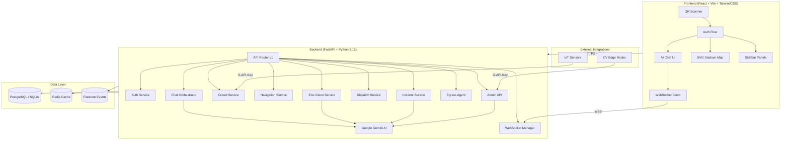

# Stadium Sync 🏟️

**A GenAI-Enabled Stadium Operations & Fan Experience Platform for FIFA World Cup 2026**

[]() []() []() []()

---

## Table of Contents

- [Overview](#overview)
- [Problem Statement Alignment](#problem-statement-alignment)
- [Architecture](#architecture)
- [Project Structure](#project-structure)
- [Technology Stack](#technology-stack)
- [Getting Started](#getting-started)
- [API Documentation](#api-documentation)
- [Testing](#testing)
- [Deployment](#deployment)
- [Environment Variables](#environment-variables)
- [Assumptions](#assumptions)

---

## Overview

Stadium Sync is a full-stack, real-time platform that leverages **Google Gemini AI** to transform the FIFA World Cup 2026 stadium experience for **fans**, **volunteers**, and **organizers**. It acts as both a personal AI concierge for fans and an operational intelligence engine for venue staff.

### Key Capabilities

| Persona | Feature | Description |
|---------|---------|-------------|
| 🎉 Fan | **AI Concierge Chat** | Natural language navigation, multilingual help, and accessibility routing powered by Gemini |
| 🎉 Fan | **QR Ticket Auth** | HMAC-signed QR codes with JWT auth for secure entry |
| 🎉 Fan | **Eco-Vision** | Camera-based AI waste classification (Gemini Vision) for sustainability |
| 🎉 Fan | **Real-Time Egress** | Personalized exit routes pushed via WebSocket at the 80th minute |
| 👷 Volunteer | **AI Dispatch** | Auto-assignment to nearest volunteer based on section proximity |
| 👷 Volunteer | **Incident Triage** | Gemini classifies severity, category, and suggests response actions |
| 📊 Organizer | **Digital Twin** | Live crowd density heatmap with linear regression congestion predictions |
| 📊 Organizer | **Admin AI Copilot** | Gemini chat with full operational context for real-time decision support |
| 📊 Organizer | **CV Webhook** | Computer Vision edge-node integration for automated crowd/safety alerts |
| 📊 Organizer | **Flash Sales** | AI-driven vendor promotions targeted at underutilized stadium sections |

---

## Problem Statement Alignment

Stadium Sync addresses **all eight verticals** from the hackathon problem statement:

| Vertical | Implementation |
|----------|---------------|
| 🗺️ **Navigation** | AI-powered seat finding, SVG map with animated routes, POI navigation (restrooms, food, medical) |
| 👥 **Crowd Management** | IoT sensor ingestion, real-time density heatmap, linear regression predictions, CV webhook alerts |
| ♿ **Accessibility** | Dedicated accessible sections, elevator/ramp routing, `needs_accessibility` flag in tickets, ARIA attributes |
| 🚌 **Transportation** | Transit method selection (Metro/Bus/Rideshare/Parking), gate-to-transit mapping, optimized egress |
| ♻️ **Sustainability** | Eco-Vision camera waste classification, bin type tracking, environmental fun facts |
| 🌐 **Multilingual Assistance** | Gemini auto-detects language and responds natively in any supported language |
| 🧠 **Operational Intelligence** | Admin AI Copilot with live state, incident triage, volunteer dispatch, crowd predictions |
| ⚡ **Real-Time Decision Support** | WebSocket-driven alerts, emergency evacuation broadcasts, flash sale targeting |

---

## Architecture



---

## Project Structure

```
stadium-sync/
├── backend/
│   ├── app/
│   │   ├── api/
│   │   │   ├── v1/               # API routes (auth, chat, crowd, egress, etc.)
│   │   │   └── deps.py           # Dependency injection (auth, DB, Redis)
│   │   ├── core/
│   │   │   ├── config.py         # Pydantic settings with production validation
│   │   │   ├── security.py       # JWT creation/verification (HS256)
│   │   │   ├── database.py       # Async SQLAlchemy engine + session management
│   │   │   ├── redis_client.py   # Redis connection with graceful fallback

│   │   │   ├── rate_limiter.py   # SlowAPI rate limiting per endpoint
│   │   │   └── exceptions.py     # Custom HTTP exceptions + error handlers
│   │   ├── middleware/
│   │   │   ├── security_headers.py # X-Content-Type-Options, X-Frame-Options, etc.
│   │   │   ├── logging_mw.py      # Structured request/response logging
│   │   │   └── request_id.py      # X-Request-ID UUID injection
│   │   ├── models/               # SQLAlchemy ORM models (15 tables)
│   │   ├── schemas/              # Pydantic response/request schemas
│   │   ├── services/             # Business logic (Gemini, navigation, dispatch)
│   │   └── main.py               # FastAPI app factory with lifespan management
│   ├── tests/                    # Pytest async test suite
│   ├── scripts/                  # Database seeder and crowd simulator
│   ├── Dockerfile                # Multi-stage production image
│   └── requirements.txt          # Pinned Python dependencies
├── frontend/
│   ├── src/
│   │   ├── api/                  # Axios client + API function exports
│   │   ├── components/           # React components (Chat, Map, Sidebar, Auth)
│   │   ├── hooks/                # Custom hooks (useChat, useRealtime)
│   │   ├── lib/                  # CSS utilities and helpers
│   │   ├── pages/                # AdminDashboard page
│   │   └── types/                # Shared TypeScript interfaces
│   ├── index.html                # Entry point with SEO meta tags
│   └── package.json              # Dependencies (React 19, Vite, TailwindCSS)
├── firestore.rules               # Locked-down Firestore security rules
├── CONTRIBUTING.md               # Contribution guidelines
├── LICENSE                       # MIT License
└── README.md                     # This file
```

---

## Technology Stack

| Layer | Technology | Purpose |
|-------|-----------|---------|
| **Frontend** | React 19, TypeScript, Vite, TailwindCSS | Responsive mobile-first PWA |
| **Animations** | Framer Motion | Smooth page transitions, message bubbles |
| **Backend** | FastAPI, Python 3.12, Uvicorn | Async REST API + WebSocket server |
| **AI Engine** | Google Gemini 2.5 Flash | Chat, triage, eco-vision, admin copilot |
| **Database** | PostgreSQL (Neon Serverless) / SQLite | Persistent storage (15 tables, async) |
| **Cache** | Redis | Rate limiting, session state, crowd cache |
| **Auth** | JWT (HS256) | Custom authentication |
| **Real-Time** | WebSocket (native) | Egress routes, alerts, crowd updates |
| **Infrastructure** | Render, Vercel | Automatic CI/CD |
| **Testing** | Pytest (async), Vitest, Testing Library | Backend + frontend test coverage |
| **Security** | SlowAPI, HMAC, CORS, CSP headers | Production-grade hardening |

---

## Getting Started

### Prerequisites

- Python 3.12+
- Node.js 20+
- Redis (optional — falls back to in-memory)

### Backend Setup

```bash
cd backend

# Create virtual environment
python -m venv .venv
source .venv/bin/activate  # or .venv\Scripts\activate on Windows

# Install dependencies
pip install -r requirements.txt

# Copy and configure environment
cp .env.example .env
# Edit .env with your Gemini API key

# Seed the database
python scripts/generate_test_tickets.py

# Start the server
uvicorn app.main:app --reload --port 8000
```

### Frontend Setup

```bash
cd frontend

# Install dependencies
npm install

# Start development server
npm run dev
```

Visit `http://localhost:5173` for the fan interface, or `http://localhost:5173?admin=true` for the organizer dashboard.

---

## API Documentation

Once the backend is running, visit:
- **Swagger UI**: `http://localhost:8000/docs`
- **ReDoc**: `http://localhost:8000/redoc`

### Key Endpoints

| Method | Endpoint | Auth | Description |
|--------|----------|------|-------------|
| `POST` | `/api/v1/auth/scan-ticket` | — | QR code ticket authentication |
| `GET` | `/api/v1/auth/me` | Fan | Get current fan session |
| `POST` | `/api/v1/chat` | Fan | AI concierge chat (Gemini) |
| `POST` | `/api/v1/navigation/transit` | Fan | Set transit preference |
| `GET` | `/api/v1/navigation/route` | Fan | Get personalized egress route |
| `POST` | `/api/v1/eco-vision/classify` | Fan | AI waste classification |
| `POST` | `/api/v1/incidents/` | Fan | Report an incident |
| `POST` | `/api/v1/crowd/ingest` | IoT | Ingest crowd density data |
| `GET` | `/api/v1/crowd/map/{id}` | Fan | Get crowd density heatmap |
| `POST` | `/api/v1/egress/trigger` | Staff | Trigger egress agent |
| `GET` | `/api/v1/admin/state` | Admin | Get digital twin state |
| `POST` | `/api/v1/admin/chat` | Admin | Admin AI Copilot |
| `POST` | `/api/v1/admin/evacuate` | Admin | Emergency evacuation broadcast |
| `WS` | `/api/v1/ws?token=` | JWT | Real-time WebSocket |

---

## Testing

### Backend Tests

```bash
cd backend
pytest tests/ -v --cov=app --cov-report=term-missing
```

### Frontend Tests

```bash
cd frontend
npm run test
```

### Lint

```bash
cd frontend
npm run lint
```

---

## Deployment

### Backend (Render)

The backend is configured for 1-click deployment on Render using the included `render.yaml` blueprint.

### Frontend (Vercel)

```bash
cd frontend
npm run build
# Deploy dist/ to Vercel
```

---

## Environment Variables

See [`backend/.env.example`](backend/.env.example) for the full list. Key variables:

| Variable | Required | Description |
|----------|----------|-------------|
| `SECRET_KEY` | ✅ | JWT signing key (32+ chars) |
| `TICKET_QR_SIGNING_KEY` | ✅ | HMAC key for QR payload integrity |
| `DATABASE_URL` | ✅ | PostgreSQL or SQLite connection string |
| `GEMINI_API_KEY_1` | ✅ | Google Gemini API key |
| `REDIS_URL` | ❌ | Redis URL (optional, graceful fallback) |
| `IOT_API_KEY` | ✅ | API key for IoT sensor endpoints |


---

## Assumptions

1. **API Availability**: Google Gemini API is available with sufficient quota.
2. **Hardware**: Venues have IoT turnstile sensors pushing to `/api/v1/crowd/ingest`.
3. **Authentication**: Production and development both use standard HS256 JWTs.
4. **Stadium Layout**: The SVG map uses a simplified coordinate system that scales to real blueprints.
5. **Real-Time**: WebSocket connections are maintained for the duration of the fan's stadium visit.

---

*Built for the Hack2Skill GDC Hackathon — FIFA World Cup 2026.*
